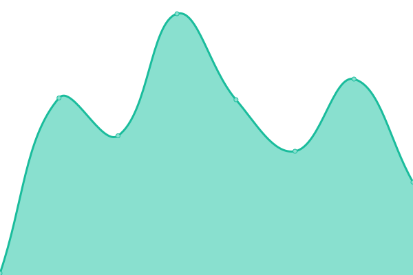
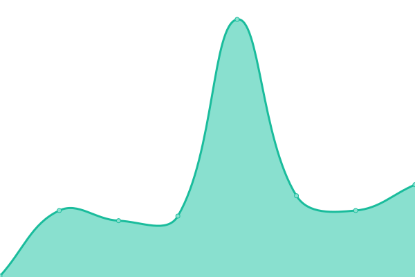
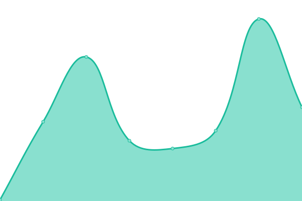

# [📈 Live Status](https://status.nandaka.site): <!--live status--> **🟥 Complete outage**

This repository contains the open-source uptime monitor and status page for [Rithvik Raj](https://status.nandaka.site), powered by [Upptime](https://github.com/upptime/upptime).

With [Upptime](https://upptime.js.org), you can get your own unlimited and free uptime monitor and status page, powered entirely by a GitHub repository. We use [Issues](https://github.com/Rtvk-001/upptime/issues) as incident reports, [Actions](https://github.com/Rtvk-001/upptime/actions) as uptime monitors, and [Pages](https://status.nandaka.site) for the status page.

<!--start: status pages-->
<!-- This summary is generated by Upptime (https://github.com/upptime/upptime) -->
<!-- Do not edit this manually, your changes will be overwritten -->
<!-- prettier-ignore -->
| URL | Status | History | Response Time | Uptime |
| --- | ------ | ------- | ------------- | ------ |
|  [AudioBookShelf](https://abs.nandaka.site) | 🟥 Down | [audio-book-shelf.yml](https://github.com/Rtvk-001/upptime/commits/HEAD/history/audio-book-shelf.yml) | 

 90ms
     
 | 

<a href="https://status.nandaka.site/history/audio-book-shelf">100.00%</a>
    

|  [Authentik](https://auth.nandaka.site) | 🟥 Down | [authentik.yml](https://github.com/Rtvk-001/upptime/commits/HEAD/history/authentik.yml) | 

 85ms
     
 | 

<a href="https://status.nandaka.site/history/authentik">100.00%</a>
    

|  [Calibre](https://calibre.nandaka.site) | 🟥 Down | [calibre.yml](https://github.com/Rtvk-001/upptime/commits/HEAD/history/calibre.yml) | 

 85ms
     
 | 

<a href="https://status.nandaka.site/history/calibre">100.00%</a>
    

|  [Immich](https://immich.nandaka.site) | 🟥 Down | [immich.yml](https://github.com/Rtvk-001/upptime/commits/HEAD/history/immich.yml) | 

 125ms
     
 | 

<a href="https://status.nandaka.site/history/immich">100.00%</a>
    

|  [Jellyfin](https://jelly.nandaka.site) | 🟥 Down | [jellyfin.yml](https://github.com/Rtvk-001/upptime/commits/HEAD/history/jellyfin.yml) | 

 88ms
     
 | 

<a href="https://status.nandaka.site/history/jellyfin">100.00%</a>
    

|  [Memos](https://memos.nandaka.site) | 🟥 Down | [memos.yml](https://github.com/Rtvk-001/upptime/commits/HEAD/history/memos.yml) | 

 77ms
     
 | 

<a href="https://status.nandaka.site/history/memos">100.00%</a>
    

<!--end: status pages-->

[**Visit our status website →**](https://status.nandaka.site)

## 📄 License

- Powered by: [Upptime](https://github.com/upptime/upptime)
- Code: [MIT](./LICENSE) © [Anand Chowdhary](https://anandchowdhary.com), supported by [Pabio](https://pabio.com)
- Data in the `./history` directory: [Open Database License](https://opendatacommons.org/licenses/odbl/1-0/)
